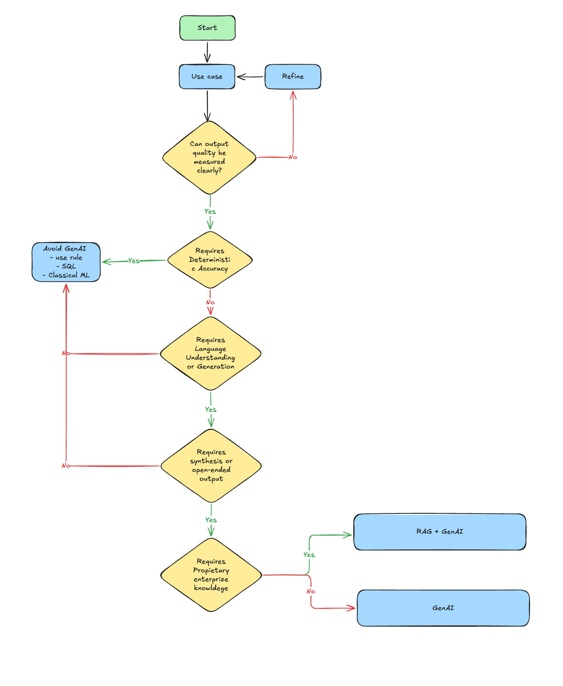
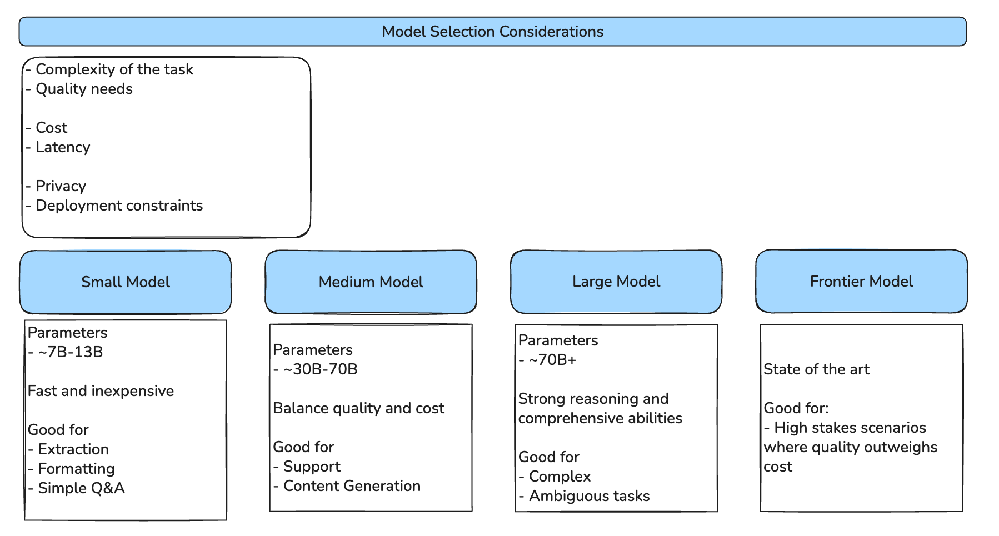

Most retrieval-agent guides open with embeddings, chunk sizes, and reranking. Those are necessary, but they are not where production failures originate. Production failures originate three decisions earlier, in choices that are made implicitly, fast, and rarely revisited. By the time the team is debating chunk overlap, the architecture has already been picked.

This post is structured around those three decisions, in order: should you use GenAI at all, which model size do you need, and how do you engineer the context window. The first two take a section each. The third is most of the post.

Each decision is a lever. When production results disappoint, you should know which one to reach for instead of reflexively shipping a bigger model or a longer prompt. Vendor specifics are deliberately absent, the patterns translate to any LLM provider, any vector store, and any orchestration layer. Where a tooling choice matters, it is called out, but the architecture is the point.

---

## Setting the Frame: The Decision Stack

Before getting into individual decisions, it helps to be precise about what each one answers, what lever it controls, and what failure mode it produces if you skip it:

| Decision | Question | Primary lever | Failure mode if skipped |
|---|---|---|---|
| 1. Use case fit | Does this problem need GenAI at all? | Architecture choice | Solving a deterministic problem with a probabilistic tool |
| 2. Model selection | Which model size meets the need? | Cost vs. capability budget | Frontier-model bills for small-model tasks |
| 3. Context architecture | What goes in the window, and in what order? | Prompt + retrieval + grounding | Retrieval-augmented hallucination |

The rest of this article unpacks each row.

---

## 1. Use Case Fit

### The decision teams skip

Reaching for GenAI is socially rewarded. It looks ambitious, it photographs well in a roadmap, and nobody wants to be the team that "just used SQL." So the first decision, *should this even be a GenAI problem?*, is often skipped, and the cost shows up later as flaky outputs, expensive evaluation cycles, and a feature nobody trusts in production.

The decision is recoverable, but only if you make it explicitly. The flowchart below names the gates:

### Walking the diamonds

**Can output quality be measured clearly?** If you cannot describe what "good" looks like, you do not have a use case yet, you have an aspiration. Refine the brief: concrete inputs, concrete outputs, an acceptance criterion, before any model selection.

**Does the task require deterministic accuracy?** Tax calculations, payroll thresholds, regulatory yes-or-no checks, these are not LLM problems. They are SQL or rules-engine problems. A 99% accurate LLM is a 1% liability in domains where the cost of a wrong answer is lawsuits or fines.

**Does the task require language understanding or generation?** This is the GenAI gate. Without it, classical ML is almost always the better tool, cheaper, more interpretable, easier to evaluate, and less prone to silent drift.

**Does the task require synthesis or open-ended output?** This is the difference between "classify this ticket as billing/technical/account" (a small classifier, possibly classical) and "draft a reply that addresses the customer's concern in our voice." The second is genuinely a generation problem; the first usually is not.

**Does the task require proprietary enterprise knowledge?** This is the RAG gate. The model can write fluent English. It cannot write fluent English about *your* contracts, *your* runbooks, *your* SKUs, unless you put that material into the context. If the task depends on private knowledge, plain GenAI is not enough; you need retrieval.

The honest result of walking this tree is that many candidate features end at "use rules, SQL, or a classical model." Stating that out loud, early, is the difference between a team that ships and a team that demos.

---

## 2. Model Selection

### A budget, not a leaderboard

Once the use case justifies GenAI, the second decision is which model. Most teams pick by reputation, *frontier model for the demo, drop down to something smaller for cost later*, and discover late that the cost of "later" was a six-month rewrite.

The right framing is a budget across six axes:

Complexity, quality, cost, latency, privacy, and deployment constraints all pull against each other. A frontier model maximises quality but blows the latency budget for an interactive UI. A small on-device model wins on privacy and latency but cannot synthesise a multi-page report. The decision is not "which model is best"; it is "which model fits the constraint set."

### Where each tier earns its keep

**Small models (~7B–13B parameters)** are the right tool for narrow rubrics: extraction, formatting, simple Q&A, classification. They are fast and cheap enough to run inline in user-facing code paths, and they can be hosted on-prem when privacy matters more than capability.

**Medium models (~30B–70B parameters)** are the workhorse tier for most production retrieval agents. Customer support, content drafting, internal knowledge assistants, the tasks where the rubric is broader than extraction but narrower than open-ended reasoning. The honest sweet spot, in cost-per-quality, for nearly every team.

**Large models (~70B+ parameters)** earn their place when the task is genuinely ambiguous or requires multi-step reasoning over long contexts. Worth the latency and the bill when the cost of a wrong answer is high, clinical decision support, legal analysis, complex code generation.

**Frontier models** are state-of-the-art and priced accordingly. Reserve them for the high-stakes paths in your product, not the entire product. A common, sensible pattern is a frontier model on the planning step and a medium model on the execution steps.

### Two caveats the diagram cannot carry

Parameter count is a proxy for capability, not the thing itself. A 2026-class small model often outperforms a 2024-class large one. Re-benchmark whenever a new generation lands; the budget shifts under your feet.

Reasoning vs. non-reasoning models change the prompt budget too. Non-reasoning models need explicit "think step-by-step" scaffolding to handle multi-hop logic; reasoning models do this internally and can actually degrade if you over-prompt them. The same task may need a different prompt depending on which model you pick, a coupling worth tracking explicitly when you migrate.

---

## 3. Context Architecture

The first two decisions are framing. The third is most of the production work, and it is where teams lose the most time. This section walks the architecture from the ceiling of plain prompting, through RAG, to the discipline of context engineering, and ends with the token economics that bound the whole thing.

### The ceiling of prompt engineering

Prompt engineering is the practice of refining the input text to optimise the output. Few-shot examples, persona assignment, chain-of-thought scaffolding, all useful, all bounded. No amount of instruction refinement can overcome three failure modes that are inherent to the model's training data:

- **Knowledge cutoff.** The model cannot answer questions about events after its training cutoff. *"Who won the 2025 Cricket world cup?"* is not a prompt-engineering problem; it is a missing-data problem.
- **Hallucination.** When asked for specific facts without external references, models prioritise plausibility over truth. And, will produce a fluent, confident, fabricated citation.
- **Ambiguity.** Without private context, models default to generic interpretations because the model has no reason to assume the technical sense.

The takeaway is structural: no amount of prompt cleverness fixes a model that simply does not know. You have to put the knowledge into the context. That is what RAG is for.

### Retrieval Augmented Generation

RAG is an architectural pattern, not a product. It has three stages:

1. **Retrieval.** Search a knowledge base (typically a vector index, often complemented by lexical search) for chunks relevant to the user's query.
2. **Augmentation.** Inject those chunks into the model's context window, alongside the system prompt and user message.
3. **Generation.** The model produces an answer grounded in the retrieved content rather than its parametric memory.

> **RAG vs. retrieval agent.** RAG is the pattern. A retrieval agent is the implementation that operationalises it, handling query routing, multi-source retrieval, reranking, and context assembly inside a real system. Most "RAG implementations" in production are retrieval agents in everything but name. Calling them what they are clarifies which problems are architectural versus operational.

### Where naive RAG fails: context rot

The first generation of RAG implementations almost universally fails the same way: developers retrieve a generous top-k, paste everything into the prompt, and watch quality degrade as they add more documents. The phenomenon has a name, **context rot**, and two distinct mechanisms:

- **Context poisoning.** Irrelevant or contradictory chunks in the prompt confuse the model. The retrieval system optimised for recall at the expense of precision; the model paid the bill.
- **Lost in the middle.** Models disproportionately attend to the start and end of long contexts. Information buried halfway through a 32k-token prompt is, in practice, often ignored, even when it is the most relevant chunk.

Both failure modes get worse, not better, as you make the context window larger. The question stops being *"did we retrieve enough?"* and starts being *"what did we put in front of the model, and in what order?"*

### Context engineering as a discipline

Context engineering is the strategic design of the entire input window. It is not a different practice from RAG; it is RAG with adult supervision. Four principles do most of the work.

**System prompts as behavioural programs.** A system prompt is not a request, it is the configuration that defines how the model operates. Three components consistently move scores: a clear role definition (*"You are a customer support assistant for QWERTY Corp"*), explicit negative constraints (*"Do not mention competitor products"*, often more reliable than positive instructions), and enforced output formatting (JSON, YAML, or structured Markdown).

**Strict grounding.** Bind the model to the retrieved context with explicit instructions: *"Answer using only the provided context chunks. If the context does not contain the answer, say so."* Grounding instructions only help if the retrieval actually contained the answer, but when it does, this single line meaningfully reduces hallucination.

**Metadata filtering before similarity.** Vector search is recall-broad. Filter the corpus by structured metadata, `year=2024`, `region=EU`, `document_owner=user_id`, before the similarity step, not after. Filtering first is cheaper, faster, and a security control: it is how you stop the model from answering questions about documents the user is not allowed to see.

**Multi-turn state management.** In an agentic system, the context window will eventually fill. The three strategies that work in practice are summarisation (compress old turns into a key-facts summary), moving window (drop oldest turns), and selective persistence (keep the user ID and active task forever, drop the rest). Each has a failure mode; pick the one whose failure mode is cheapest in your domain.

<!-- > **[PLACEHOLDER]:** *Field note from a project — e.g., switching from "rerank everything we retrieve" to "filter by document owner first, rerank a small set" cut latency and improved faithfulness scores. Insert a real example here.* -->

### The token economy

Even an elegantly engineered context is bounded by the model's context window of 8k, 32k, 128k, or more, which represents the hard limit of working memory. That window is a budget, split three ways: instructions, retrieved documents, and conversation history. Output tokens consume the same pool.

Two optimisations consistently move the needle in production.

**Just-in-time retrieval.** Instead of front-loading the prompt with everything the agent might need, expose retrieval as a *tool* the agent can call when it actually needs information. This shifts retrieval from preprocessing to runtime, trading a bit of latency for a much smaller, more focused context. It also makes the agent's reasoning auditable, you can see exactly which documents it asked for.

**Reranking.** Retrieve a generous top-50 with cheap vector search, then rerank with a small dedicated model, and inject only the top 3–5 chunks into the final prompt. This is one of the highest-leverage moves in production RAG, it is cheap, it directly attacks the lost-in-the-middle problem, and it is independent of the main model choice.

Both optimisations couple back to **Decision Two**. A medium model with a tight reranker and just-in-time retrieval often outperforms a frontier model fed 128k of unfiltered context, at a fraction of the cost. Bigger windows are not free, using them well is the design problem.

---

## Putting the Stack Together

The three decisions are not a one-shot waterfall. They form a loop, and bad production results should send you back up the stack rather than down the same path with bigger numbers.

If outputs are confidently wrong on factual queries, your context architecture is leaking, retrieval is missing the right chunks, or grounding instructions are weak. If outputs are bland or off-target on nuanced queries, your model selection may be too small for the task, but check context first, small-model failures and context-starvation failures look identical from the outside. If outputs are fine but cost is unsustainable, the answer is rarely a smaller model alone, it is a smaller model paired with better reranking and just-in-time retrieval. And if no amount of context engineering moves the needle, revisit the use case fit. The original problem may have been deterministic all along.

The cheapest fix is almost always at the context layer, the most expensive is at the use-case layer, because it means rebuilding. Walking the stack downward is fast, walking it upward is admitting an earlier decision was wrong, and that is exactly the move that protects you from shipping a feature nobody trusts.

---

## Conclusion

A retrieval agent is not a model with documents bolted on. It is a stack of three decisions, each with its own failure mode, each with its own lever. The seductive failure mode is to skip the first two and treat every problem as a context-engineering problem, to throw chunks at the model until it behaves. The slower, harder, more durable approach is to make the upstream decisions explicit, then let the architecture flow from them.

The mappings are tight enough to memorise. **Use case fit** asks whether this needs GenAI, plain GenAI, or RAG-augmented GenAI; if the answer is "none of the above," that is a feature, not a failure. **Model selection** is a budget across six axes, not a leaderboard rank, and worth re-evaluating every model generation. **Context architecture** is where prompt engineering hits a ceiling, RAG raises it, context engineering keeps it raised, and reranking plus just-in-time retrieval keep it affordable.

What this article cannot give you are the specific thresholds, retrieval configurations, and model choices for your domain. Those are empirical, hard-won, and specific to your data and your users. Treat the stack as a framework, not a recipe, the framework tells you which question to ask next when the recipe stops working.

<!-- > **What's next.** This post is the architectural framing. The follow-up will go one level deeper into the part most production teams underestimate — document parsing and chunking, where the choice of chunk size, overlap, and layout-awareness silently sets the ceiling on every other layer of the stack. -->

<!-- > **[PLACEHOLDER]:** *Optional first-person field note. The 20260430_mlops.md post uses one in italics at the conclusion to reinforce a real example — consider adding one here from a recent project.* -->
