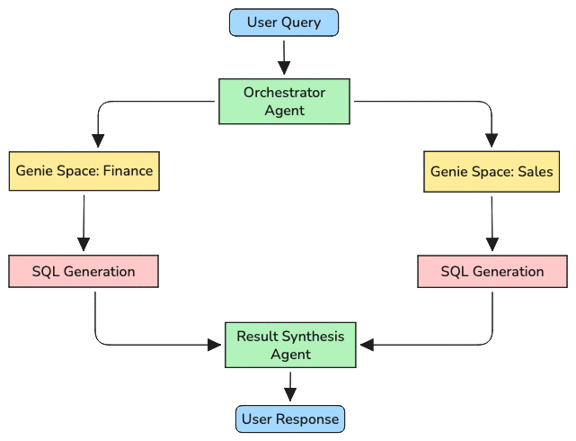

> *A practitioner's guide to deploying Genie in production and avoiding the traps that catch most teams off guard.*

---

Databricks AI/BI Genie has quickly become one of the most compelling offerings in the modern data stack. The promise is straightforward: give business users a natural language interface to their lakehouse data, eliminate SQL gatekeeping, and democratize analytics at scale. In practice, however, deploying Genie, especially as a component inside a larger agentic system, is considerably more nuanced than the demos suggest.

This article is a frank look at the architectural constraints, operational realities, and governance risks you'll encounter when taking Genie to production. It's written for data engineers, ML platform teams, and architects who are past the "should we try Genie?" phase and deep into "how do we make this work reliably?"

---

## What Genie Actually Is (and Isn't)

At its core, Genie is a natural-language-to-SQL engine tightly integrated with the Databricks Lakehouse. Each deployment is scoped to a **Genie Space**, an isolated configuration that defines which tables, columns, and business glossary terms the assistant can reason over. Queries are processed by an underlying LLM (typically Azure OpenAI), grounded in real schema metadata from Unity Catalog, and executed against Databricks SQL compute.

The key differentiator Databricks emphasizes is **hallucination resistance**: because Genie works from actual schema metadata rather than LLM training data alone, it avoids the "confident nonsense" problem that plagued earlier NL-to-SQL tools. This is real and meaningful, but it's a reduction in hallucination risk, not an elimination of it.

What Genie is *not* is a zero-configuration, plug-and-play analytics layer. The gap between a working demo and a reliable production deployment is significant, and most of the failure modes are invisible until you've already shipped.

---

## How Genie Fits into Agentic Architectures

The more interesting use case isn't Genie as a standalone BI chatbot, it's Genie as a **tool-calling component inside a larger agent system**. In this architecture, a coordinating orchestrator agent routes natural language queries to one or more Genie Spaces, collects structured results, and synthesizes responses alongside other data or reasoning steps.

One pattern that's shown genuine promise in production is the **"species" model** i.e. treating each Genie Space as an isolated agent species with domain-specific knowledge, maintained by the team closest to that data. A Sales Genie owned by revenue ops, a Finance Genie owned by FP&A, an Operations Genie owned by the supply chain team. The orchestrator routes; the species specialize.

This architecture offers real benefits: reduced schema noise per agent, cleaner governance boundaries, and independent iteration cycles. It also introduces new complexity, which we'll get to.

---

## Critical Pitfalls

### 1. Schema Context Drift

This is the most common cause of "Genie started giving wrong answers" incidents. Genie Spaces learn schema context at configuration time, they are **not** automatically synchronized with schema changes in your lakehouse. Rename a column, drop a table, add a new dimension, Genie doesn't know.

The failure mode is subtle. Genie won't throw an error. It will continue generating SQL that references the old column name, or silently misconstruct queries that appear to return results but reflect a stale mental model of your schema.

**What to do:** Treat Genie Space metadata as a first-class production artifact with CI/CD coverage. Implement automated schema diff checks that trigger Space re-evaluation whenever upstream table definitions change. Assign explicit ownership of each Space so there's a human accountable for its accuracy.

---

### 2. The Hallucination That Doesn't Look Like One

Users trust Genie more than they trust traditional BI tools precisely because it "explains itself" in natural language. A dashboard silently returning zero is suspicious. Genie confidently describing a revenue trend is not, even when the SQL behind that explanation is subtly wrong.

Genie can and does:

- Misinterpret column names that phonetically resemble business concepts
- Infer relationships between tables that don't exist in your schema
- Generate syntactically valid SQL that is semantically incorrect
- Return numerically plausible but factually wrong aggregations

**What to do:** Always surface the generated SQL alongside the answer. Consider dual-LLM verification (one model generates, a second critiques). Train users to treat Genie as a "suggestion engine," not an oracle, the same epistemics you'd apply to any AI-generated output.

---

### 3. The Over-Specialization Trap

The species model is powerful, but there's a failure mode on the other side: too many narrowly-scoped Genie Spaces creates fragmentation. Users don't know which Genie to ask. A "Sales Genie" correctly refuses to answer "What was our marketing spend relative to revenue?", and the user's reasonable response is to abandon the tool entirely.

**What to do:** Design Space boundaries around **user roles and workflows**, not data domains. Real business questions are cross-functional; your Genie architecture needs to accommodate that. Implement a lightweight orchestration layer that can fan out to multiple Spaces and synthesize results. Document a "Genie map" so users understand the landscape.

---

### 4. The Black Box SQL Problem

Genie generates SQL automatically. By default, users and often administrators have no easy way to audit what SQL was generated for a given conversational query. In regulated industries, this is a compliance problem. In any environment, it's an operational risk.

Unauditable SQL generation creates:

- **Security exposure:** Generated queries may access data patterns beyond user intent
- **Performance risk:** Genie-generated SQL can be inefficient and cause resource contention
- **Debugging friction:** When something's wrong, reproducing the exact query is difficult
- **Compliance gaps:** Banking, healthcare, and energy environments require query audit trails

**What to do:** Enable full query logging with user attribution. Use Databricks SQL query history as your Genie audit trail. For sensitive operations, consider a dual-mode approach: Genie for exploration and discovery, hand-crafted SQL for production reporting.

---

### 5. LLM Vendor Lock-in and Cost Volatility

Genie's query generation layer is coupled to the configured LLM. This means model upgrades, API rate limits, and pricing changes at the LLM layer directly affect Genie's accuracy and operating cost, often without any change on your end.

Model version changes can introduce accuracy regressions. Rate limit events cause cascading timeouts. Cost-per-query can shift meaningfully across model generations.

**What to do:** Pin model versions explicitly and maintain rollback procedures. Implement query cost monitoring with alerting thresholds. Test accuracy after every model version change, treat it like a dependency upgrade with regression risk.

---

## Architectural Gotchas

### Compute Resource Contention

Genie query execution competes for the same SQL compute resources as your production dashboards and pipelines. During peak periods, Genie queries can starve production workloads (or vice versa). Auto-scaling doesn't always respond fast enough to handle Genie query bursts.

**Recommendation:** Provision dedicated SQL Warehouses for Genie with independent auto-scaling limits. Monitor Genie query patterns separately from production SQL metrics.

---

### Latency Is Real

Genie is not a fast BI tool. A complete query cycle involves multiple network hops:

1. User input to Genie API
2. Genie to LLM for SQL generation
3. LLM response back to Genie
4. Genie to Databricks SQL engine
5. SQL execution and data scan
6. Results back through the chain

For complex queries, end-to-end latency of 5–30 seconds is common. Users accustomed to sub-second dashboard loads will notice.

**Recommendation:** Set SLA expectations explicitly. Implement query caching for repeated questions. Use progressive disclosure UX patterns, "thinking..." states with intermediate feedback rather than hard waits.

---

### Session State Accumulates

Genie maintains conversation context within a session. Long-running conversations can approach context window limits, and follow-up questions can "corrupt" earlier context in ways that are hard to diagnose. A user who says "actually, ignore my earlier filter" may get behavior that's difficult to predict.

**Recommendation:** Implement session timeouts with context resets. Provide a clear "start fresh" affordance in any user-facing interface. For programmatic agent integrations, treat each Genie call as stateless where possible.

---

### Integration Overhead in Agent Frameworks

When integrating Genie into LangChain, Databricks Agent Bricks, or custom agent frameworks, each Genie call adds meaningful API latency. Failures (i.e. timeouts, schema errors, LLM rejections) must be explicitly caught and handled. Standard agent evaluation metrics don't map cleanly to Genie's output characteristics.

**Recommendation:** Implement circuit breakers for Genie tool calls. Maintain fallback query paths for critical data needs. Log all Genie interactions for downstream evaluation.

---

## Governance and Security Considerations

### Unity Catalog Integration Has Gaps

Genie operates within Unity Catalog's governance framework, but the integration is not complete. Dynamic row-level security policies may not propagate correctly to Genie-generated queries. Permission inheritance can behave unexpectedly at the Space level. Data lineage visible in Unity Catalog may not surface to Genie users.

**What to do:** Test row-level security behavior with Genie explicitly, don't assume Unity Catalog permissions propagate automatically. Monitor for inadvertent permission bypass via generated SQL.

---

### Data Exfiltration via Natural Language

"Show me all customer email addresses" is a perfectly valid natural language query that Genie may execute without any additional access controls, if the underlying tables are in scope for the Space. There's no native approval workflow, no data classification awareness in query generation, and no "sensitive field" guard by default.

**What to do:** Configure Genie Spaces to explicitly exclude PII/PHI tables. Implement workspace-level restrictions on sensitive schemas. Build data classification awareness into your Space configuration review process.

---

### Audit Trail Gaps

Genie query history may not integrate natively with SIEM tooling, regulatory audit pipelines, or existing "who touched what data" attribution frameworks. For organizations with formal audit requirements, this is a gap that needs to be engineered around.

**What to do:** Build an explicit logging layer that captures the natural language query, the generated SQL, the executing user identity, and the timestamp. Feed this into your existing audit infrastructure.

---

## Genie Code: The Agentic Evolution

Databricks recently extended Genie beyond Q&A into agentic engineering capabilities through **Genie Code**, following the Quotient AI acquisition. Where Genie answers questions, Genie Code generates:

- Python ML pipeline code from natural language specifications
- SQL stored procedures and transformation logic
- Databricks Jobs configurations
- MLflow experiment definitions

Genie Code also introduces continuous RL-based evaluation of agent responses, multi-LLM routing based on query complexity, and parallel analysis paths with synthesized results.

This is a genuine capability expansion, but it introduces a new class of risk. Generated code may not follow engineering best practices, may contain security vulnerabilities, and will often be difficult for humans to maintain or debug after the fact. The "correctness" of generated code is also inherently more subjective than the correctness of a SQL result.

**Treat Genie Code output as draft.** Implement quality gates before any generated code touches production pipelines. Maintain a library of "golden examples" that encode your engineering standards. Human review is not optional.

---

## The "Zero-Shot" Expectation Problem

Perhaps the most dangerous misconception is that Genie will "just work" with minimal configuration. It won't, at least not at production quality. The demo-to-production gap is real and substantial.

Production-grade Genie requires:

- Careful table and column selection per Space (not "everything")
- Business glossary integration for domain terminology
- Custom instructions that encode organizational context
- An ongoing feedback loop from real user queries
- A dedicated "Genie owner" responsible for Space quality
- Regular workspace audits as schemas and business logic evolve

Organizations that succeed with Genie treat their Genie Spaces as **living products**, not one-time configurations. The ones that fail treat setup as a project milestone and move on.

---

## Recommendations for Safe Implementation

**Pre-launch checklist:**

- Define measurable accuracy targets (e.g., X% of test queries answered correctly)
- Identify the ten most critical queries that must always work
- Design Space boundaries around user roles, not data domains
- Document schema change procedures that include Space update steps
- Assign an accountable owner per Space
- Build a fallback query path for when Genie fails or times out

**Operational essentials:**

- Log everything: queries, generated SQL, user feedback, response times
- Build a monitoring dashboard for accuracy, cost, and schema drift
- Implement automated schema diff alerts
- Run quarterly Space audits, treat them like infrastructure health checks
- Track "helpful" vs "unhelpful" response rates as a primary quality metric

**Governance non-negotiables:**

- All Genie-generated queries logged with user attribution
- Row-level security behavior explicitly tested per Space
- PII/PHI tables explicitly excluded from Space scope
- Workspace configuration changes under version control with review workflow

---

## The Bottom Line

Databricks Genie is a genuinely powerful capability both as a standalone analytics interface and as a component in larger agentic systems. The multi-genie "species" architecture in particular offers a promising model for scalable, domain-isolated data agents with clear governance ownership.

But Genie is not infrastructure you configure once and forget. It requires ongoing investment in workspace quality, schema monitoring, governance, and user enablement. The hallucination resistance is real but partial. The governance integrations are solid but incomplete. The agentic capabilities are expanding rapidly and bringing new risk profiles with them.

The organizations getting the most value from Genie are the ones who treat it like the production-grade AI system with dedicated ownership, rigorous monitoring, clear quality standards, and honest expectations. That's not a low bar. But for teams willing to clear it, Genie represents a meaningful step toward genuinely democratized, governed, and reliable access to data at scale.

---

