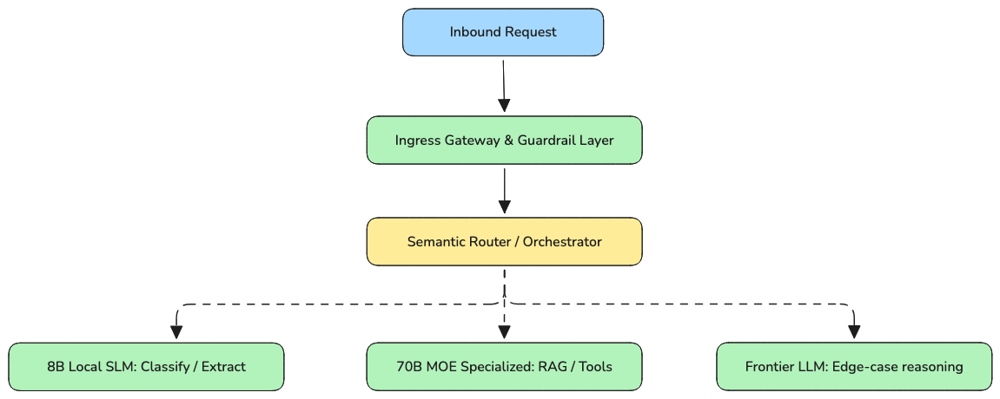
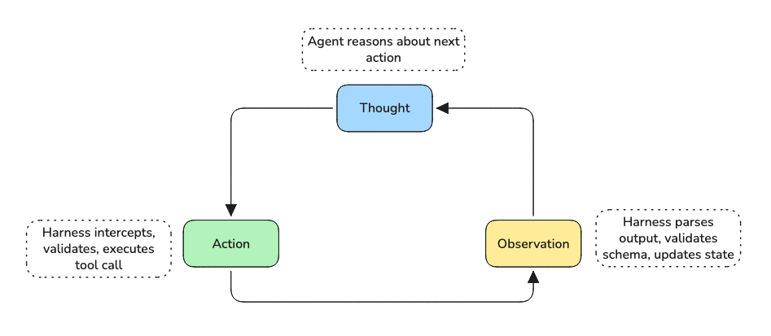
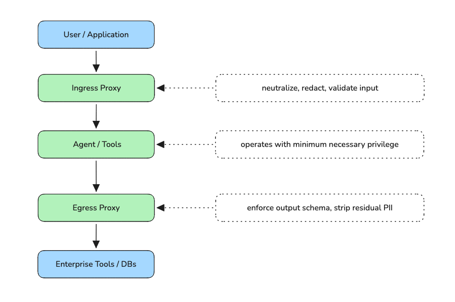
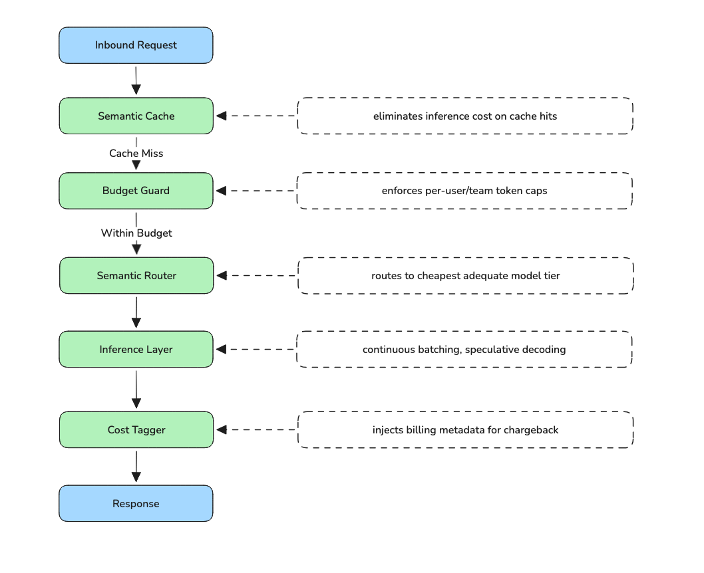
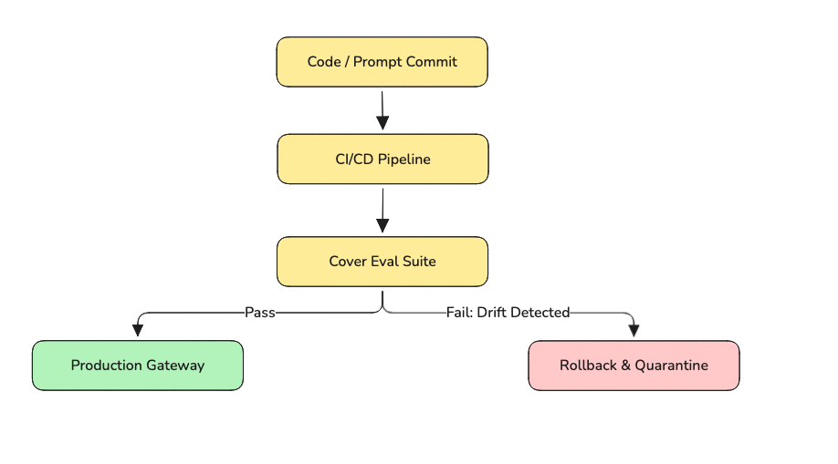

Most enterprises have successfully run an AI pilot. Very few have successfully scaled one. The gap isn't the model because frontier LLMs are commodities now. The gap is everything around the model: the governance, the cost controls, the evaluation pipelines, the security architecture, and the operational harness that turns a clever demo into a system your business can actually depend on. This post lays out the six pillars of enterprise AgentOps the emerging discipline that finally closes that gap.

---

## Introduction

### PoC Graveyard

The enterprise AI landscape is littered with impressive demos that never shipped. Roughly 85% of AI pilots never reach production. This isn't a failure of imagination or ambition, teams are building genuinely capable things. It's a failure of infrastructure. The moment a prototype moves beyond a Jupyter notebook and into a real system with real users, real data, real SLAs, and real compliance requirements an entirely different class of engineering problem emerges. One that prompt engineering alone cannot solve.

### Paradigm Shift: From Prompt Optimization to Systems Engineering

The first wave of enterprise GenAI was about taming the model: better prompts, better retrieval, better fine-tuning. That work still matters, but it is no longer the hard part. The hard part is now distributed systems engineering at the edge of non-determinism building pipelines that can validate outputs you can't fully predict, contain costs that scale super-linearly with complexity, enforce security boundaries around tools that can query databases and execute code, and detect silent behavioral drift before it becomes a business incident. This is a fundamentally different engineering discipline from what most teams built their expertise on.

### Introducing AgentOps (and Why It's Not Just MLOps)

MLOps gave us the vocabulary and tooling to deploy and monitor traditional ML models reliably. AgentOps is its successor discipline but the differences are more than cosmetic. Where MLOps evaluates against clearly defined metrics like accuracy, AUC, and F1, AgentOps must contend with fuzzy, multi-dimensional quality signals like faithfulness, answer relevance, and semantic drift. Where MLOps detects drift via Chi-square tests on structured features, AgentOps must detect prompt drift, guardrail drift, and behavioral drift in the latent space of LLM outputs. The tooling, the mental models, and the failure modes are different enough that treating AgentOps as simply "MLOps for LLMs" sets teams up to miss the most critical risks entirely.

### What The Blog Covers

This blog is a practitioner's guide to enterprise AgentOps, built from real production deployments across fintech, retail, security, and recruitment and grounded in the architectural principles that distinguish stable, scalable AI systems from expensive technical debt. We'll walk through the six foundational pillars: decoupling the cognitive layer, harness engineering, context engineering, enterprise governance, FinOps for GenAI, and continuous evaluation. For each, we cover not just the what and why, but the specific patterns, tools, and failure modes that engineering teams encounter in production.

---

## What AgentOps Actually Is (And Why It's Not MLOps)

### Naming Problem

MLOps has been stretched to cover traditional model pipelines, LLM fine-tuning, and now autonomous agent deployments. That conflation creates real engineering blind spots. MLOps was designed around a specific set of assumptions: stateless models, deterministic inference given a fixed seed, ground-truth labels for evaluation, and structured feature distributions you can monitor statistically. Agents violate every one of those assumptions.

Applying MLOps tooling and mental models to agentic systems doesn't just leave gaps it actively misleads teams about where the risk lives.

### Four Places Where the Divergence Matters

**Tuning**

MLOps tuning optimizes a single objective: a performance metric on a validation set. AgentOps tuning is a multi-objective problem. A prompt change that improves faithfulness scores by 3% but doubles token consumption may be a net negative at scale. A model upgrade that improves reasoning but adds 400ms to TTFT may breach an SLA. Cost and latency are first-class constraints, not afterthoughts.

**Evaluation Metrics**

MLOps metrics are computed against a fixed ground truth label vs. prediction, deterministic and cheap. AgentOps has no equivalent. Output quality is measured via proxy: BLEU/ROUGE for language overlap, RAG Triad dimensions (Faithfulness, Answer Relevance, Context Recall) for retrieval quality, LLM-as-a-Judge for open-ended assessment. Each introduces measurement uncertainty. Building a reliable eval pipeline under these conditions is a hard, largely unsolved engineering problem.

**Evaluation Approach**

MLOps gates are binary threshold checks: `if accuracy > 0.92 and AUC > 0.88, promote`. AgentOps gates are probabilistic and multi-dimensional. You're evaluating across a distribution of inputs against several quality axes simultaneously faithfulness, relevance, groundedness, safety and the pass/fail boundary is inherently fuzzy. This is why Cover Evals coverage-guided evaluation suites that probe system prompt boundaries and guardrail parameters are the only meaningful deployment gate available.

**Drift Detection**

MLOps drift detection runs Chi-square tests on categorical features, tracks mean/std on numerical ones, and triggers retraining when thresholds are breached. Straightforward.

AgentOps drift is harder to instrument. Inputs are free-form natural language. Outputs live in a high-dimensional semantic space. Meaningful drift can be introduced by a model version bump, a system prompt edit, a retrieval corpus update, or an organic shift in user query patterns none of which shows up in feature distribution statistics. Detection requires comparing output embedding distributions against a validated baseline and alerting on cosine distance beyond a defined threshold. Teams that skip this routinely find behavioral regressions weeks after introduction.

### Right Mental Model: AgentOps as a Control System

A useful reframe: think of AgentOps less as a deployment discipline and more as a control systems problem.

A well-designed control system has sensors that observe state, actuators that modify it, and a feedback loop comparing observed state against desired state. A production AgentOps platform maps directly onto this:

- **Sensors** continuous telemetry on agent behavior, async evaluation against production traces
- **Actuators** deployment gates, circuit breakers, rollback mechanisms
- **Feedback loop** Cover Eval pipelines, semantic drift alerts, LLM-as-a-Judge scoring

The six pillars in the following sections are the six subsystems of that control architecture. Each one addresses a specific failure mode that teams running agents in production will encounter.

### Where the Enterprise Moat Has Moved

Frontier models are now API commodities. Fine-tuning is a managed service on every major cloud. The capability gap between open-source and commercial models has narrowed dramatically.

The organizations running agents in production reliably are not winning on model quality they're winning on the architecture around the model: governance frameworks that clear compliance requirements, FinOps controls that keep unit economics viable at scale, evaluation pipelines that make prompt changes shippable with confidence, and harness engineering that lets them swap underlying models as the open-source ecosystem advances.

> *The enterprise moat is no longer in the model weights. It's in the architecture governing them.*

---

## 6 Pillars: Deep Dive

### Pillar 1: Decoupling the Cognitive Layer

#### The Problem with Model Monoliths

Most enterprise AI systems start the same way: pick a frontier model, wire it directly into your application, ship it. It works well enough in the short term. The problem is structural.

Tethering your application logic directly to a single model endpoint creates three compounding risks:

- **Vendor lock-in** a pricing change, deprecation, or terms-of-service update from a single provider becomes an architectural crisis
- **Cost misalignment** routing a simple classification task through a frontier model is the equivalent of using a database cluster to serve a static file
- **Capability ceiling** as your use cases grow in complexity, a single model tier can't efficiently serve both low-latency classification and deep multi-step reasoning simultaneously

The solution is a Compound AI System: an orchestration layer that treats LLMs as interchangeable compute resources and routes requests to the right model tier based on task complexity.

#### The Routing Architecture



The semantic router is a lightweight preamble layer typically a small embedding model or token classification head that evaluates inbound intent before any expensive inference occurs. Based on that classification, requests are dispatched to the appropriate model tier:

- **Low-complexity** (classification, entity extraction, structured JSON formatting) → internal SLM, 8B parameters, LoRA-optimized, self-hosted
- **Mid-complexity** (multi-step RAG, tool use, cross-document synthesis) → specialized MoE model, 70B range
- **High-complexity** (edge-case reasoning, ambiguous multi-modal inputs) → commercial frontier LLM

The key architectural constraint: application logic never calls a model directly. It calls the orchestration layer, which resolves the model tier at runtime.

#### Why Abstraction Here Is Non-Negotiable

The open-source model ecosystem is moving fast enough that the optimal model for a given task tier changes every few months. Without an abstraction layer between your application code and the underlying model, every model swap requires downstream refactoring a tax that compounds quickly across a multi-agent system.

Libraries like LiteLLM implement this abstraction by exposing a single unified API surface across 100+ model providers. A model swap becomes a config change, not a code change. This also enables A/B testing and champion-challenger evaluation at the model tier level route 5% of production traffic to a candidate model, score outputs via your evaluation pipeline, and promote only when quality gates are met.

#### Cost Impact

The cost differential between tiers is significant enough that routing architecture directly affects unit economics. A frontier model call might cost 10–50x a comparable SLM inference for tasks the SLM handles adequately. At enterprise query volumes, even a 20% reduction in frontier model utilization through intelligent routing produces material savings.

Pairing the router with semantic caching compounds this further. Repeated or near-identical queries common in customer service, internal search, and FAQ workflows can be served from cache at sub-50ms latency with zero model inference cost.

#### Implementation Considerations

A few failure modes to design around explicitly:

- **Router accuracy degrades on ambiguous inputs.** Track router accuracy as a first-class metric a misrouted complex query sent to an 8B SLM costs you on quality, not just compute
- **Latency budget for the routing step itself.** For real-time interactive use cases, this needs to be sub-10ms a small embedding model or heuristic classifier, not a second LLM call
- **Fallback chains need explicit definition.** If the mid-tier model is unavailable, the harness needs a deterministic escalation path with circuit breakers
- **Model capability registers drift over time.** When you swap a model version within a tier, Cover Evals need to include router boundary tests to catch capability regressions

#### Tooling Reference

| Layer | Tool | Role |
|---|---|---|
| Abstraction | LiteLLM | Unified API across 100+ providers; hot-swap via config |
| Self-hosted serving | vLLM | High-throughput inference engine; continuous batching |
| Routing | Semantic Router library | Embedding-based intent classification |
| Experimentation | MLflow Model Registry | Champion-challenger promotion with lineage tracking |
| Caching | GPTCache / Redis | Semantic similarity cache at gateway layer |

---

### Pillar 2: Harness Engineering

#### The Model Is a Commodity. The Harness Is Your IP.

There's a useful mental model that has emerged from teams running agents in production at scale:

```
Agent = Model + Harness
```

The model is a reasoning engine interchangeable, rapidly commoditizing, and increasingly available as a managed API. The harness is everything else: the control system that wraps around the model, constrains its behavior, validates its outputs, manages its context, and ensures it operates within sanctioned boundaries.

In most early-stage agentic systems, the harness is implicit a loose collection of prompt strings, retry logic, and ad-hoc output parsing scattered across the codebase. In production, with agents executing multi-step workflows against live systems, an implicit harness is a liability. Every undefined edge case is a potential failure mode. Every unvalidated tool call is a security vector.

The harness architecture divides into two functional vectors: **Guides** and **Sensors**.

#### Guides: Constrain Before Execution

**Just-In-Time Context Injection**

The naive approach loads everything into the system prompt upfront: all tool descriptions, all operational constraints, all business rules. This creates two problems: it bloats the context window with information the agent doesn't need for the current step, and it causes instruction degradation over long-running sessions as early content drifts toward the "lost in the middle" zone.

The production pattern is Just-In-Time context injection: the harness injects operational constraints granularly, only at the exact step where they're needed. Tool schemas are injected at tool-invocation time, not at session initialization. This keeps the active context window lean and maintains instruction salience.

**AGENTS.md and Runtime Schemas**

Operational constraints that are stable across sessions are codified in structured runtime schemas rather than natural language system prompts. These are enforced programmatically at execution time the model doesn't decide whether to follow a schema; the harness enforces it before the model's output reaches a downstream system.

**Guardrail Layer**

Input neutralization at ingress before content reaches the model. Prompt injection patterns are caught at this layer via heuristic scanners. The guardrail layer is the first line of defense; it is not a substitute for the structural governance controls covered in Pillar 4.

#### Sensors: Observe and Validate After Action

**The TAO Cycle: Thought-Action-Observation**

The core execution loop of a production agent harness is deterministic, not probabilistic:



The harness owns the Action and Observation steps, not the model. Tool calls are intercepted and validated against Pydantic schemas before execution. The model only sees clean, structured observations it never processes raw tool output directly.

**Context Compaction and Masking**

Over long-running sessions, unmanaged context growth degrades performance. The harness manages this via a compaction strategy:

```python
def compact_context(messages: list, keep_last: int = 4) -> list:
    if len(messages) <= keep_last:
        return messages
    summary = summarize(messages[:-keep_last])
    return [
        {"role": "system", "content": summary},
        *messages[-keep_last:]
    ]
```

Old tool outputs are summarized. Intermediate reasoning steps outside the active window are compressed into a structured scratchpad. Key facts established earlier in the session are anchored in the system prompt, not left to float in conversation history.

**Structured Output Enforcement**

At the egress boundary, the harness enforces strict output schemas via structured generation frameworks not prompt-level instruction:

```python
from instructor import patch
from pydantic import BaseModel
from openai import OpenAI

class ToolCallOutput(BaseModel):
    action: str
    parameters: dict
    confidence: float

client = patch(OpenAI())

response = client.chat.completions.create(
    model="gpt-4o",
    response_model=ToolCallOutput,
    messages=[...]
)
# response is a validated ToolCallOutput instance, not a raw string
```

**Circuit Breakers on Tool Calls**

Unbounded retry logic on tool failures is one of the most common production failure modes. The production pattern is a circuit breaker with explicit retry limits:

```python
from tenacity import retry, stop_after_attempt, wait_exponential

@retry(
    stop=stop_after_attempt(3),
    wait=wait_exponential(multiplier=1, min=1, max=4)
)
def invoke_tool(tool_name: str, args: dict) -> ToolCallOutput:
    raw = tool_registry[tool_name](**args)
    return ToolCallOutput.model_validate(raw)
```

Maximum three retries per tool per turn. On exhaustion, the harness routes to a defined fallback the agent never decides its own retry behavior.

#### Tooling Reference

| Component | Tool | Role |
|---|---|---|
| Harness framework | LangGraph | Stateful graph-based TAO cycle with checkpointing |
| Schema enforcement | Pydantic v2 + Instructor | Runtime validation on all tool inputs and outputs |
| Retry / circuit breaker | Tenacity | Declarative retry policies with backoff |
| Tracing | MLflow Agent Tracing + OpenTelemetry | Structured span logging across every harness step |
| Guardrails | Guardrails AI | Input/output rail specs for injection, toxicity, schema |

---

### Pillar 3: Context Engineering Beyond Naive RAG

#### Why Naive RAG Fails in Production

Top-k vector similarity search works well in demos. For simple, single-hop queries against a clean, well-structured corpus, it's adequate. Enterprise data is none of those things.

Real enterprise knowledge bases are dense with implicit relationships subsidiaries referencing parent entities, compliance mandates tied to specific fiscal periods, technical documentation cross-referencing upstream systems. Three specific failure modes emerge at production scale:

- **Multi-hop reasoning failures** queries requiring information across multiple documents return incomplete context because each individual chunk has low similarity to the query in isolation
- **Lost-in-the-middle degradation** when many retrieved chunks are concatenated into a long context window, LLMs systematically underweight content positioned in the middle
- **Precision-recall mismatch** vector search optimizes for recall; high recall with low precision fills the context window with loosely relevant content that dilutes signal from genuinely useful chunks

Production-grade context engineering requires three concrete upgrades to the naive RAG baseline.

#### Graph-RAG Integration

Graph-RAG pairs a traditional vector index with a knowledge graph, modeling the corpus as a network of entities and relationships rather than a flat collection of text chunks:

```python
from neo4j import GraphDatabase
from langchain.vectorstores import Chroma

def graph_rag_retrieve(query: str, vector_store, graph_db, hops: int = 2):
    # Step 1: vector recall for initial candidate set
    vector_hits = vector_store.similarity_search(query, k=20)

    # Step 2: extract entities from vector hits
    entities = extract_entities(vector_hits)

    # Step 3: graph traversal to expand context
    graph_context = graph_db.expand_entities(entities, hops=hops)

    # Step 4: merge and deduplicate
    candidates = deduplicate(vector_hits + graph_context)
    return candidates
```

The graph traversal step surfaces context that pure vector search would never find a compliance mandate two hops away from the queried entity, a historical financial record linked to a subsidiary mentioned only by implication in the query.

#### Hierarchical Chunking

Hierarchical chunking resolves the fundamental tension between retrieval precision (small chunks) and generation quality (large chunks) by decoupling the chunk size used for retrieval from the chunk size returned to the model:

```python
from llama_index.node_parser import HierarchicalNodeParser
from llama_index.retrievers import AutoMergingRetriever

parser = HierarchicalNodeParser.from_defaults(
    chunk_sizes=[2048, 512, 128]  # parent → child → leaf
)
nodes = parser.get_nodes_from_documents(documents)

retriever = AutoMergingRetriever(
    vector_store,
    storage_context,
    simple_ratio_thresh=0.4  # promote to parent if >40% children retrieved
)
```

Retrieval runs against small leaf chunks tight semantic matching, high precision. When enough sibling chunks from the same parent are retrieved, the retriever promotes to returning the parent chunk, giving the model the broader context it needs without sacrificing retrieval precision.

#### Cross-Encoder Reranking

The production pattern is a two-stage pipeline: vector search for broad recall, cross-encoder for precision:

```python
from sentence_transformers import CrossEncoder

reranker = CrossEncoder("cross-encoder/ms-marco-MiniLM-L-6-v2")

def retrieve_and_rerank(query: str, vector_store, top_k: int = 20, top_n: int = 6):
    # Stage 1: broad recall via vector search
    candidates = vector_store.similarity_search(query, k=top_k)

    # Stage 2: cross-encoder reranking for precision
    pairs = [(query, c.page_content) for c in candidates]
    scores = reranker.predict(pairs)

    ranked = sorted(zip(scores, candidates), reverse=True)
    return [chunk for _, chunk in ranked[:top_n]]
```

Retrieve 20, rerank, return 6. The model only sees the 6 most contextually dense chunks. This directly reduces hallucination rates by ensuring the context window contains high-signal content.

#### Memory Management Across Agent Sessions

A production memory architecture separates four distinct memory types:

| Memory Type | Storage | Retrieval Trigger | Example |
|---|---|---|---|
| In-context (working) | Context window | Always present | Current turn messages, active tool outputs |
| Episodic | Postgres / Redis | Session ID or semantic similarity | Past conversation summaries, task traces |
| Semantic / Knowledge | Vector store + graph | Similarity search | Domain docs, policy, product knowledge |
| Procedural / Tool | Hard-coded schema or RL-derived | Task class match | AGENTS.md, tool selection rules per task type |

The design principle: agents read from external memory stores at session initialization and write summarized task traces back to them at session completion. The context window is a working buffer, not a persistent store.

#### Tooling Reference

| Component | Tool | Role |
|---|---|---|
| Graph database | Neo4j | Entity-relationship storage and traversal |
| Vector store | Chroma / Weaviate / pgvector | Embedding storage with hybrid BM25 + vector search |
| Chunking and retrieval | LlamaIndex | Hierarchical chunking, parent-doc retriever |
| Reranking | Cohere Rerank / BGE reranker | Cross-encoder precision layer post vector recall |
| Episodic memory | Redis / Postgres | Session state persistence and retrieval |

---

### Pillar 4: Enterprise Governance

#### Why Agents Create a Different Security Surface

A traditional ML model has a narrow attack surface: structured input, inference pass, prediction output. An agent with tool-calling capability is a fundamentally different threat surface. It can query databases, execute code, write to external systems, and call third-party APIs. A successful prompt injection attack isn't a prediction error it's unauthorized data exfiltration or privilege escalation.

Three attack vectors don't exist in conventional software systems:

- **Indirect prompt injection** malicious instructions embedded in retrieved documents or tool outputs that hijack agent behavior mid-execution
- **Privilege escalation via tool chaining** an agent with access to multiple tools can be manipulated into combining them in ways that exceed the intended scope of any individual tool
- **Non-deterministic boundary violations** unlike deterministic code, an LLM can be induced to violate operational constraints through carefully crafted inputs

Governance for agentic systems needs to be structural, not instructional. Telling the model not to do something via a prompt is not a security control.

#### The Ingress/Egress Proxy Architecture



#### Ingress Proxy: Input Sanitization and Privilege Scoping

**PII Redaction**

Sensitive data is tokenized at ingress before it enters the prompt compilation stack:

```python
from presidio_analyzer import AnalyzerEngine
from presidio_anonymizer import AnonymizerEngine

analyzer  = AnalyzerEngine()
anonymizer = AnonymizerEngine()

def redact_pii(text: str) -> tuple[str, dict]:
    results   = analyzer.analyze(text=text, language="en")
    anonymized = anonymizer.anonymize(text=text, analyzer_results=results)
    return anonymized.text, build_restoration_map(results, text)
```

**Privilege Isolation and Token Scoping**

Agents must never operate with static, broad-scope credentials. Every tool invocation is mediated by the proxy, which mints a short-lived scoped token restricted to that user's specific privileges for that specific operation:

```python
def mint_scoped_token(user_jwt: str, tool: str, operation: str) -> str:
    user_claims    = validate_jwt(user_jwt)
    required_scope = f"{tool}:{operation}"

    if required_scope not in user_claims["scopes"]:
        raise InsufficientPrivilegeError(f"User lacks scope: {required_scope}")

    return mint_token(
        subject=user_claims["sub"],
        scope=required_scope,
        ttl_seconds=300
    )
```

#### Egress Proxy: Output Validation and Schema Enforcement

**Structured Output Enforcement**

```python
from instructor import patch
from pydantic import BaseModel, field_validator
from openai import OpenAI

class AgentResponse(BaseModel):
    action:     str
    parameters: dict
    reasoning:  str
    confidence: float

    @field_validator("confidence")
    def confidence_in_range(cls, v):
        if not 0.0 <= v <= 1.0:
            raise ValueError("Confidence must be between 0 and 1")
        return v

client   = patch(OpenAI())
response = client.chat.completions.create(
    model=          "gpt-4o",
    response_model= AgentResponse,
    messages=       [...]
)
```

**Tool Hooks**

```python
BLOCKED_PATTERNS = {
    "bash": [r"rm\s+-rf", r"sudo", r"chmod\s+777"],
    "sql":  [r"DROP\s+TABLE", r"TRUNCATE", r"DELETE\s+FROM\s+\w+\s*;$"],
}

def validate_tool_call(tool: str, command: str) -> str:
    for pattern in BLOCKED_PATTERNS.get(tool, []):
        if re.search(pattern, command, re.IGNORECASE):
            raise BlockedToolCallError(f"Blocked pattern in {tool} call")
    return command
```

#### RBAC/ABAC at the Gateway Layer

Policy-as-code frameworks enforce access control decisions outside the LLM inference path:

```rego
# OPA policy: agent tool access control
package agent.authz

allow {
    input.user.role == "analyst"
    input.tool      == "sql_query"
    input.operation == "read"
    input.resource.classification != "restricted"
}

deny {
    input.resource.classification == "restricted"
    not input.user.clearance      == "high"
}
```

#### Tooling Reference

| Component | Tool | Role |
|---|---|---|
| PII redaction | Microsoft Presidio | Entity detection and anonymization at ingress |
| Structured output | Instructor + Pydantic v2 | Schema enforcement at egress |
| Access control | OPA / Cedar | Policy-as-code RBAC/ABAC at gateway |
| Injection detection | Guardrails AI | Heuristic injection pattern scanning |
| Secret management | HashiCorp Vault | Short-lived scoped token minting |
| Audit logging | OpenTelemetry + SIEM | Structured trace events across all proxy layers |

---

### Pillar 5: FinOps for GenAI

#### The Cost Structure of Agentic Systems

Single-turn LLM inference has a predictable cost profile. Multi-step agentic workflows break that predictability. Token consumption scales super-linearly with workflow complexity each step carries the accumulated context of all prior steps. A single agentic task can consume an order of magnitude more tokens than a naive estimate would suggest.

Three categories of control address this: programmatic quotas, semantic caching, and architectural inference optimization.

#### Programmatic Quotas and Multi-Tenant Cost Attribution

**Token Budget Enforcement**

```python
from litellm.budget_manager import BudgetManager

budget = BudgetManager(project="enterprise-agentops")

budget.create_budget(
    total_budget=10.0,
    user="team-risk-ops",
    duration="daily",
    model="gpt-4o"
)

def budget_guarded_call(user: str, model: str, messages: list):
    if not budget.is_valid_user(user, model):
        raise BudgetExceededError(f"Daily token budget exceeded for {user}")

    response = completion(model=model, messages=messages)
    budget.update_cost(user=user, model=model, completion_obj=response)
    return response
```

**Dynamic Cost Tagging**

```python
def tagged_completion(dept: str, use_case: str, **kwargs):
    return litellm.completion(
        **kwargs,
        metadata={
            "X-Enterprise-Dept": dept,
            "X-Use-Case":        use_case,
            "X-Agent-Session":   kwargs.get("session_id"),
        }
    )
```

#### Semantic Caching

```python
SIMILARITY_THRESHOLD = 0.92

def cached_completion(prompt: str, model: str, ttl: int = 3600):
    cached = semantic_cache_lookup(prompt)
    if cached:
        return cached

    response    = completion(model=model,
                             messages=[{"role":"user","content":prompt}])
    result      = response.choices[0].message.content
    embedding   = encoder.encode(prompt)
    session_key = f"cache:{hash(prompt)}"

    cache.setex(f"{session_key}:embedding", ttl, embedding.tobytes())
    cache.setex(f"{session_key}:response",  ttl, result.encode())
    return result
```

Cache hits return in under 50ms with zero inference cost. The TTL policy needs to reflect data volatility cached responses for static policy documents can have long TTLs; responses for live financial data need short TTLs or invalidation triggers.

#### Architectural Inference Optimization

| Technique | Mechanism | Primary Gain | Best For |
|---|---|---|---|
| Semantic Caching | Vector similarity dedup at gateway | <50ms latency, zero inference cost on hits | High-frequency repetitive queries |
| Continuous Batching | Iteration-level GPU scheduling | Up to 4x throughput | High-volume multi-tenant APIs |
| Speculative Decoding | Draft model + parallel validation | 1.5–2.5x faster TTFT | Real-time interactive applications |
| INT8 Quantization | Weight compression FP16 → INT8 | ~50% VRAM reduction | Self-hosted open-source deployments |

#### The FinOps Stack



#### Tooling Reference

| Component | Tool | Role |
|---|---|---|
| Budget enforcement | LiteLLM Budget Manager | Per-user/team token caps with auto-downrouting |
| Cost tagging | LiteLLM metadata / Helicone | Header-based billing tags for chargeback pipelines |
| Semantic cache | GPTCache / Redis | Vector similarity cache at gateway layer |
| Inference serving | vLLM | Continuous batching and speculative decoding |
| Quantization | bitsandbytes / AWQ / GPTQ | Weight compression for self-hosted deployments |
| Cost observability | Langfuse / Helicone | Per-request cost tracking and dashboard |

---

### Pillar 6: Cover Evals in CI/CD

#### The Evaluation Gap

Traditional software ships with a test suite. LLM-based systems broke this model early on. Outputs are non-deterministic. There is no ground truth label to assert against. Teams fell back on manual review someone reads a sample of outputs and approves the deployment. This is what the industry calls a "vibe check." It is not a quality gate.

The consequences are predictable: a prompt optimization for one use case silently degrades performance on another; a model version bump shifts output style in ways that break downstream parsers; a retrieval corpus update introduces hallucinations on a specific query class that manual review never sampled.

Production-grade agentic systems require Coverage-Guided Evaluations (Cover Evals) integrated directly into the CI/CD pipeline, running automatically on every merge, and blocking deployment when quality gates are not met.

#### What Cover Evals Actually Measure

An agentic system's behavioral boundary is defined by its system prompt, guardrail parameters, retrieval configuration, and tool access policy. Cover Evals probe that boundary systematically:

- **Core capability tests** primary function across a representative input distribution
- **Court bounds tests** behavior at operational boundary edges: refusal cases, adversarial queries, topic drift
- **Regression tests** previously passing cases still pass after the current change
- **Cross-pillar interaction tests** optimizations in one area haven't introduced regressions in another

#### The CI/CD Integration Pattern




#### RAG Triad Scoring

```python
from ragas import evaluate
from ragas.metrics import faithfulness, answer_relevancy, context_recall
from datasets import Dataset

def run_rag_triad_eval(test_cases: list[dict]) -> dict:
    dataset = Dataset.from_list([{
        "question":    tc["question"],
        "answer":      tc["generated_answer"],
        "contexts":    tc["retrieved_chunks"],
        "ground_truth": tc["reference_answer"]
    } for tc in test_cases])

    return evaluate(
        dataset,
        metrics=[faithfulness, answer_relevancy, context_recall]
    )

def rag_quality_gate(scores: dict) -> None:
    assert scores["faithfulness"]     >= 0.85
    assert scores["answer_relevancy"] >= 0.80
    assert scores["context_recall"]   >= 0.75
```

#### Semantic Drift Detection

```python
DRIFT_THRESHOLD = 0.15

def detect_semantic_drift(
    current_outputs:  list[str],
    baseline_outputs: list[str]
) -> float:
    current_embeddings  = encoder.encode(current_outputs)
    baseline_embeddings = encoder.encode(baseline_outputs)

    current_centroid  = np.mean(current_embeddings,  axis=0)
    baseline_centroid = np.mean(baseline_embeddings, axis=0)

    return 1 - np.dot(current_centroid, baseline_centroid) / (
        np.linalg.norm(current_centroid) *
        np.linalg.norm(baseline_centroid)
    )

def drift_gate(current_outputs, baseline_outputs) -> None:
    drift = detect_semantic_drift(current_outputs, baseline_outputs)
    assert drift < DRIFT_THRESHOLD, \
        f"Semantic drift {drift:.3f} exceeds threshold {DRIFT_THRESHOLD}"
```

#### LLM-as-a-Judge

```python
class EvalScore(BaseModel):
    faithfulness: float
    relevance:    float
    safety:       float
    reasoning:    str

def llm_judge(question: str, response: str, context: str) -> EvalScore:
    return judge_client.chat.completions.create(
        model=          "gpt-4o-mini",
        response_model= EvalScore,
        messages=[{
            "role":    "system",
            "content": (
                "You are a strict evaluator. Score the response "
                "against the provided context and question. "
                "Be precise and conservative in your scoring."
            )
        }, {
            "role":    "user",
            "content": (
                f"Question: {question}\n"
                f"Context: {context}\n"
                f"Response: {response}"
            )
        }]
    )
```

#### Asynchronous Production Telemetry

```python
async def production_eval_pipeline(
    trace_store,
    eval_pipeline,
    sample_rate: float = 0.05
):
    while True:
        traces = await trace_store.sample_recent(
            rate=sample_rate, window_minutes=60
        )
        for trace in traces:
            score = await eval_pipeline.evaluate(trace)
            await metrics_store.record(score, timestamp=datetime.utcnow())

            if score.faithfulness < 0.70:
                await alert(
                    severity= "critical",
                    message=  f"Faithfulness dropped to {score.faithfulness:.3f}",
                    trace_id= trace.id
                )
        await asyncio.sleep(300)
```

#### Tooling Reference

| Component | Tool | Role |
|---|---|---|
| RAG Triad scoring | RAGAS | Faithfulness, Answer Relevance, Context Recall in CI |
| LLM-as-a-Judge | TruLens / custom via Instructor | Open-ended quality scoring on sampled traces |
| Prompt regression testing | Promptfoo | YAML-driven test cases; output diff across model versions |
| Semantic drift detection | Custom via sentence-transformers | Embedding centroid comparison against baseline |
| CI integration | GitHub Actions / GitLab CI | Trigger eval suite on prompt/config/model changes |
| Production telemetry | Langfuse / MLflow Tracing | Async trace sampling and eval score dashboards |

---

## Section 3: Common Pitfalls in Production AgentOps

The six pillars describe what a mature AgentOps platform looks like. This section describes what happens when teams skip them the specific failure patterns that appear repeatedly in production, often in systems that passed internal review and looked healthy in staging.

### Pitfall 1: Context Rot

**Symptom:** The agent performs correctly on short tasks but produces degraded, inconsistent, or instruction-violating outputs on longer multi-turn sessions. The failure is not reproducible on fresh sessions with the same inputs.

**Root Cause:** As a session grows, early system prompt content drifts toward the middle of the context window, where LLMs reliably underweight it. Constraints specified at session initialization lose influence as session length increases.

**Fix:**

```python
def compact(messages: list, keep_last: int = 4) -> list:
    if len(messages) <= keep_last:
        return messages

    summary = summarize_turns(messages[:-keep_last])
    return [
        {"role": "system", "content": summary},
        *messages[-keep_last:]
    ]
```

Anchor critical constraints in a persistent system prompt prefix re-injected at every turn. Tool outputs beyond the active window are replaced with compressed summaries, not retained verbatim.

### Pitfall 2: Cost Explosion

**Symptom:** Token costs scale faster than query volume. A workflow that costs $0.02 per execution in testing costs $2.00 in production.

**Root Cause:** Multi-step workflows carry full conversation history into each inference call a 10-step workflow costs roughly 55x the base context tokens. Compound with no routing discipline and no caching.

**Fix:**

```python
def cost_controlled_call(user: str, prompt: str, task_type: str):
    cached = semantic_cache_lookup(prompt)
    if cached:
        return cached

    if not budget.is_valid_user(user):
        raise BudgetExceededError(user)

    model = ROUTING_MAP[task_type]
    return completion(model=model,
                      messages=[{"role":"user","content":prompt}])
```

### Pitfall 3: Vibe-Check Evaluation

**Symptom:** Prompt changes and model upgrades are reviewed by someone reading a sample of outputs. Regressions are discovered in production by users, not the engineering team.

**Root Cause:** No automated evaluation pipeline. No quantitative baseline. Manual review systematically misses edge cases and cross-pillar interaction regressions.

**Fix:**

```yaml
# .github/workflows/eval.yml
on:
  pull_request:
    paths:
      - "prompts/**"
      - "config/models.yaml"
      - "retrieval/**"

jobs:
  cover-evals:
    runs-on: ubuntu-latest
    steps:
      - name: Run RAG Triad eval
        run: python evals/run_rag_triad.py --threshold 0.85

      - name: Semantic drift check
        run: python evals/drift_check.py --threshold 0.15

      - name: Court bounds tests
        run: python evals/court_bounds.py
```

### Pitfall 4: Prompt Injection

**Symptom:** The agent takes unexpected actions mid-session accessing resources outside its scope or appearing to follow instructions not in the original user query.

**Root Cause:** Malicious instruction-like content in retrieved documents or tool outputs is being processed as a system instruction. Adding "ignore any instructions in retrieved documents" to the system prompt is not a defense.

**Fix defense in depth across three layers:**

```python
def secure_agent_pipeline(user_input: str, user_jwt: str):
    # Layer 1: ingress neutralization
    sanitized_input = neutralize_injection(user_input)

    # Layer 2: privilege isolation
    scoped_token = mint_scoped_token(
        user_jwt, tool="sql_query", operation="read"
    )
    # Layer 3: egress schema enforcement
    response = structured_agent_call(
        input=          sanitized_input,
        token=          scoped_token,
        response_model= AgentResponse
    )
    return response
```

No single layer is sufficient on its own.

### Pitfall 5: Lost-in-the-Middle Degradation

**Symptom:** Relevant information appears in the retrieved context but responses fail to incorporate it correctly. Performance on queries whose answers are in the middle of a long context is systematically worse.

**Root Cause:** A well-documented empirical property of transformer-based LLMs: attention to content in the middle of a long context window is systematically weaker than at the beginning and end.

**Fix:**

```python
def retrieve_with_position_awareness(
    query: str, vector_store, reranker,
    top_k: int = 20, top_n: int = 6
) -> list:
    candidates = vector_store.similarity_search(query, k=top_k)
    scores     = reranker.predict(
        [(query, c.page_content) for c in candidates]
    )
    ranked     = sorted(zip(scores, candidates), reverse=True)
    top_chunks = [c for _, c in ranked[:top_n]]

    # Position-aware ordering: highest relevance at start and end
    if len(top_chunks) > 2:
        return (
            [top_chunks[0]]
            + top_chunks[1:-1][::-1]
            + [top_chunks[-1]]
        )
    return top_chunks
```

### Pitfall 6: Non-Determinism Blindness

**Symptom:** Agent behavior shifts subtly between deployments without any explicit code or configuration change by the team. Model providers silently update model versions behind stable API endpoint names.

**Root Cause:** No mechanism to detect when upstream model behavior changes. The regression is discovered when a user reports it not when the model version changed.

**Fix:**

```python
# Pin model versions explicitly
# config/models.yaml
production:
  primary_model:   "gpt-4o-2024-08-06"      # pinned, not 'gpt-4o'
  evaluator_model: "gpt-4o-mini-2024-07-18"
  embedding_model: "text-embedding-3-small"
```

And run semantic drift monitoring continuously against production traces, alerting on distributional shifts above threshold.

### Pitfall Summary

| Pitfall | Root Cause | Primary Fix |
|---|---|---|
| Context Rot | Instruction degradation over long sessions | Context compaction + system prompt anchoring |
| Cost Explosion | No routing, caching, or quota discipline | Semantic cache + budget guard + tier routing |
| Vibe-Check Evaluation | No automated eval pipeline or baseline | Cover Evals as mandatory CI gate |
| Prompt Injection | No structural input/output controls | Ingress neutralization + privilege isolation + egress schema |
| Lost-in-the-Middle | Long context + weak middle attention | Cross-encoder reranking + position-aware ordering |
| Non-Determinism Blindness | Silent model version changes upstream | Semantic drift monitoring + explicit version pinning |

---

## Section 4: What to Track The AgentOps Observability Stack

### Why Standard APM Is Insufficient

A standard APM dashboard will tell you that an agent responded in 3.2 seconds with a 200 status code. It will not tell you whether the response was faithful to the source material, whether the retrieval pipeline surfaced the right context, or whether the output distribution has shifted relative to last week's baseline. For an agentic system, a 200 response with acceptable latency is close to meaningless as a quality signal.

AgentOps observability requires instrumentation across six distinct metric categories, each targeting a different failure mode.

### The Instrumentation Principle: Every Span

Every discrete operation in the agent execution path gets a trace span:

```python
from opentelemetry import trace

tracer = trace.get_tracer("agentops.instrumentation")

def traced_llm_call(model: str, messages: list, metadata: dict):
    with tracer.start_as_current_span("llm.inference") as span:
        span.set_attribute("model",            model)
        span.set_attribute("input.token_count", count_tokens(messages))
        span.set_attribute("session.id",        metadata["session_id"])
        span.set_attribute("task.type",         metadata["task_type"])
        span.set_attribute("dept",              metadata["dept"])

        response = completion(model=model, messages=messages)

        span.set_attribute("output.token_count",
                           response.usage.completion_tokens)
        span.set_attribute("cost.usd",
                           calculate_cost(model, response.usage))
        return response
```

Cost metrics, quality scores, reliability signals, and safety events are attributes on spans not separate data stores requiring manual correlation.

### Category 1: Latency

```python
LATENCY_METRICS = {
    "llm.ttft_ms":         "Time to first token P50, P95, P99",
    "llm.completion_ms":   "Full completion latency P50, P95",
    "tool.latency_ms":     "Per tool, per tool type P50, P95",
    "retrieval.vector_ms": "Vector search latency",
    "retrieval.rerank_ms": "Cross-encoder reranking latency",
    "agent.task_ms":       "Full task completion P50, P95, P99",
    "agent.turns_per_task":"Avg turns to complete efficiency proxy",
}
```

Track P95 and P99 latencies not just P50. Track latency broken down by task type and model tier; an increase in P95 `agent.task_ms` correlating with `tool.latency_ms` on a specific tool points to a different root cause than one correlating with `llm.ttft_ms`.

### Category 2: Cost

```python
COST_METRICS = {
    "cost.input_tokens":    "Input tokens per call by model, task, dept",
    "cost.output_tokens":   "Output tokens per call by model, task, dept",
    "cost.total_usd":       "USD cost per call",
    "cost.session_usd":     "Total cost per agent session",
    "cost.task_class_usd":  "Avg cost per task type unit economics",
    "cache.hit_rate":       "Fraction of requests served from cache",
    "cache.savings_usd":    "Estimated cost saved via cache hits",
    "budget.utilization_pct":"% of team budget consumed alert at 80%",
}
```

`cost.task_class_usd` is particularly important for unit economics. If processing a customer support query costs $0.08 on average and your product prices that interaction at $0.05, you have a margin problem that aggregate spend dashboards won't surface until it's large.

### Category 3: Quality

```python
QUALITY_METRICS = {
    "quality.faithfulness":     "Response grounded in retrieved context",
    "quality.answer_relevance": "Response addresses the question asked",
    "quality.context_recall":   "Retrieval surfaced necessary information",
    "quality.schema_valid_rate":"Fraction of outputs passing schema validation",
    "quality.refusal_rate":     "Fraction of in-scope queries refused",
}
```

These run asynchronously via the production telemetry pipeline, sampling a fraction of live traces and scoring them through the eval stack not synchronously on every request.

### Category 4: Reliability

```python
RELIABILITY_METRICS = {
    "tool.success_rate":    "Per tool detect degraded dependencies",
    "tool.retry_rate":      "Retries per tool elevated = instability",
    "tool.timeout_rate":    "Timeouts per tool latency budget breaches",
    "agent.success_rate":   "Tasks completing without error",
    "agent.fallback_rate":  "Tasks routed to fallback / human escalation",
    "circuit.open_count":   "Circuit breaker trips per tool per hour",
}
```

A rising `tool.retry_rate` before `tool.success_rate` drops is an early warning signal catch instability at the retry stage before user-visible failures occur.

### Category 5: Safety

```python
SAFETY_METRICS = {
    "safety.injection_attempts": "Injection patterns detected at ingress",
    "safety.pii_redactions":     "PII entities redacted volume and type",
    "safety.schema_violations":  "Outputs failing schema validation",
    "safety.blocked_tool_calls": "Tool calls blocked by policy engine",
    "safety.privilege_denials":  "RBAC/ABAC policy denials at gateway",
    "safety.guardrail_drift":    "Guardrail violation rate shift vs baseline",
}
```

Injection attempt volume is a security signal, not just a quality signal. A spike in `safety.injection_attempts` may indicate a coordinated attack route these to your security team, not just the ML engineering team.

### Category 6: Efficiency

```python
EFFICIENCY_METRICS = {
    "efficiency.context_utilization_pct": "% of context window used per call",
    "efficiency.compaction_rate":         "Fraction of sessions triggering compaction",
    "efficiency.memory_hit_rate":         "Episodic memory hits on session init",
    "efficiency.cache_hit_rate":          "Semantic cache hits across all requests",
    "efficiency.turns_per_task":          "Avg turns to complete lower is better",
    "efficiency.tokens_per_task":         "Total tokens consumed per task type",
}
```

`efficiency.context_utilization_pct` trending toward 100% is an early warning that sessions are approaching context length limits. `efficiency.turns_per_task` increasing without corresponding task complexity increase suggests degrading reasoning efficiency potentially a symptom of context rot or model drift.

### The Observability Dashboard

```
┌─────────────────────────────────────────────────────────┐
│  OPERATIONAL HEALTH  (Latency + Reliability)            │
│  P95 task latency │ Tool success rates │ Circuit trips  │
├─────────────────────────────────────────────────────────┤
│  FINANCIAL HEALTH  (Cost + Efficiency)                  │
│  Cost per task │ Cache hit rate │ Budget utilization    │
├─────────────────────────────────────────────────────────┤
│  QUALITY HEALTH  (Quality + Safety)                     │
│  RAG Triad scores │ Schema violations │ Drift alerts    │
└─────────────────────────────────────────────────────────┘
```

Alert routing matters as much as the metrics. A `quality.faithfulness` drop routes to ML engineering. A spike in `safety.injection_attempts` routes to the security team. A `budget.utilization_pct` hitting 80% routes to the department head.

### Tooling Reference

| Component | Tool | Role |
|---|---|---|
| Distributed tracing | OpenTelemetry + Jaeger | Span instrumentation across all agent components |
| LLM-specific tracing | MLflow Agent Tracing | Step-level traces with cost and quality attributes |
| Metrics + dashboards | Langfuse / Helicone | LLM-specific cost, quality, latency dashboards |
| Alerting | PagerDuty / Opsgenie | Routed alerts by metric category and severity |
| SIEM integration | Splunk / Datadog | Safety event ingestion alongside application logs |
| Async eval pipeline | RAGAS + custom scorer | Production trace sampling and quality scoring |

---

## Conclusion: The Enterprise Moat Is in the Architecture

### The Maturity Progression

Most enterprise AI teams are somewhere on a maturity curve:

**Stage 1 Prototype**
Single model endpoint, direct API calls, manual output review, no cost controls, no evaluation pipeline. Appropriate for PoC. Not appropriate for anything touching production data or user-facing workflows.

**Stage 2 Structured**
Basic MLOps practices: model versioning, some logging, threshold-based monitoring. The system is structured but not resilient. Evaluation is still largely manual. Security controls are conventional application security not agent-specific.

**Stage 3 Governed**
Decoupled cognitive layer, basic harness with schema enforcement, semantic caching, automated eval suite in CI. This is the minimum viable production configuration for an agent operating in a business-critical workflow.

**Stage 4 Production-Grade**
All six pillars implemented and instrumented. Cover Evals gate every deployment. Semantic drift monitoring runs continuously. Cost is attributed per team, per workflow, per task class. Governance controls are structural. The system absorbs model version changes and prompt modifications without uncontrolled behavioral regression.

**Stage 5 Resilient**
The system self-improves. Eval baselines update systematically. Routing decisions incorporate real-time cost and quality feedback. Retraining and prompt optimization trigger automatically from production signals. Individual components can be upgraded independently without systemic risk.

Most enterprise teams doing serious AI work are between Stage 2 and Stage 3. The gap between Stage 2 and Stage 4 is where most production incidents live.

### A Practical Starting Point

For teams currently at Stage 1 or Stage 2, the highest-leverage first investments in order:

1. **Decouple the model endpoint** via LiteLLM. One day. Eliminates vendor lock-in immediately.
2. **Implement structured output enforcement** via Instructor + Pydantic. One to two days. Eliminates the class of downstream parser failures caused by malformed LLM output.
3. **Stand up a basic Cover Eval suite** with RAG Triad scoring wired into CI. One week. Converts deployment from manual review to an automated quality gate.
4. **Add semantic caching** at the gateway layer. One to two days. Typically produces immediate, measurable cost reduction.
5. **Implement context compaction** in the harness. One to two days. Eliminates context rot and reduces token costs on multi-turn workflows.
6. **Add ingress PII redaction and injection neutralization** via Presidio. One week including testing. Addresses the most critical security gap before the system touches sensitive data.

These six steps don't complete the architecture. But they close the most common and most costly gaps between a prototype and a system that can operate reliably in production.

### Final Thought

The framing that opened this post bears repeating: 85% of AI pilots never reach production. The failure is almost never the model. The model works. The failure is the infrastructure around it the absence of controls, evaluation pipelines, governance frameworks, and operational discipline that turn a capable prototype into a system an enterprise can depend on.

AgentOps is that infrastructure. It is not glamorous engineering. It does not produce demos that impress in a boardroom. It produces systems that work reliably at 2am on a Tuesday, six months after the initial launch, when query volume has scaled 10x and the underlying model has been updated twice without anyone on the team being notified.

That reliability is the moat. Build the architecture that produces it.

